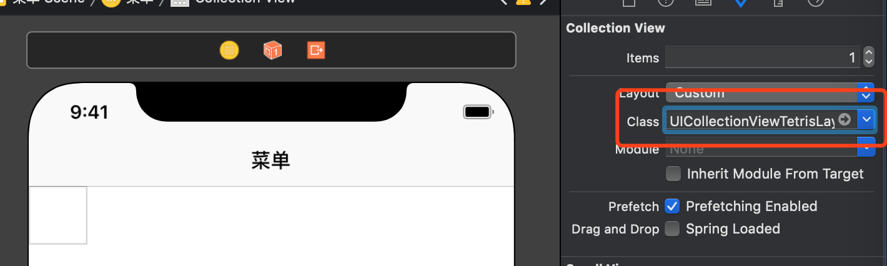
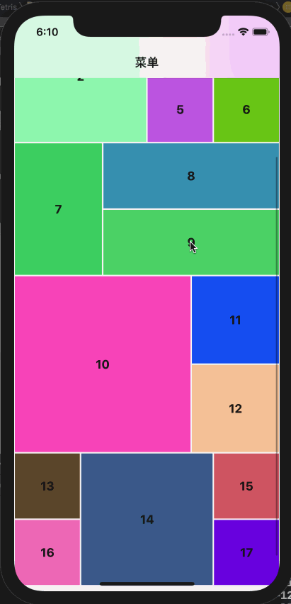

# UICollectionViewTetris
俄罗斯方块布局

## 使用
### 1.  设置`UICollectionView` 的 `layout` 为`UICollectionViewTetrisLayout`


### 2. 设置`UICollectionViewTetrisLayout`的代理
``` objc
UICollectionViewTetrisLayout *tetrisLayout = (UICollectionViewTetrisLayout *)self.collectionViewLayout;
    tetrisLayout.delegate = self;
```
``` objc
#pragma mark - UICollectionViewDelegateTetrisLayout
- (CGSize)collectionView:(UICollectionView *)collectionView layout:(UICollectionViewLayout*)collectionViewLayout sizeForItemAtIndexPath:(NSIndexPath *)indexPath
{
    UICellMenuItemModel *cellModel = self.arrCellModels[indexPath.row];
    return CGSizeMake(cellModel.itemWidth, cellModel.itemHeight);
}
```

## 效果


